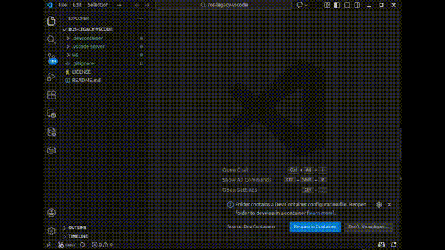

# ros-legacy-vscode

This repository provides VS Code support for Docker containers running legacy ROS distributions (ROS Melodic as an example) on Ubuntu versions earlier than 20.04.

## Installation

1. Make sure to download the complete repository. Use `git clone https://github.com/ravijo/ros-legacy-vscode` or download zip as per your convenience. Below is an example:
    ```bash
    git clone https://github.com/ravijo/ros-legacy-vscode
    cd ros-legacy-vscode/
    ```
2. Download `bin.tar.gz` from the GitHub [Releases](https://github.com/ravijo/ros-legacy-vscode/releases) page, and extract it using `tar -xzvf /path/to/downloaded/bin.tar.gz` inside `vscode-server` folder. Below is an example:
    ```bash
    cd ros-legacy-vscode/
    tar -xzvf ~/Downloads/bin.tar.gz -C .vscode-server
    ```

#### Folder Structure

It is important to have `.vscode-server` correctly setup. make sure the folder structure matches with following:

```bash
.
├── .devcontainer
│   ├── devcontainer.json
│   ├── Dockerfile
│   └── entrypoint.sh
├── .gitignore
├── LICENSE
├── README.md
├── .vscode-server
│   ├── bin
│   │   └── 994fd12f8d3a5aa16f17d42c041e5809167e845a
│   │       ├── bin
│   │       ├── extensions
│   │       ├── LICENSE
│   │       ├── node
│   │       ├── node_modules
│   │       ├── out
│   │       ├── package.json
│   │       └── product.json
│   └── .gitkeep
└── ws
    ├── .catkin_workspace
    └── src
        ├── .gitkeep
        ├── package1 # Your first ROS Package goes here
        └── package2 # Your second ROS Package goes here
```

## Run

Open the project inside VS Code and select "Reopen in Container"
    ```bash
    cd ros-legacy-vscode/
    code .
    ```

## Demonstration

<p align="center">
    
    </br>
    <sup>Sample video showing demo of ros-legacy-vscode</sup>
</p>


## Environment

This repository has been tested on:

### Host PC

| Component | Version                      |
|-----------|------------------------------|
| OS        | Ubuntu 24.04.3 LTS (64-bit)  |
| Kernel    | 6.14.0-37-generic            |
| GLIBC     | 2.39                         |
| Docker    | 29.1.3                       |
| VS Code   | 1.107.1                      |

### Guest PC

| Component | Version                      |
|-----------|------------------------------|
| OS        | Ubuntu 18.04.3 LTS (64-bit)  |
| ROS       | Melodic                      |


### VS Code Extensions

Below is the version information of the extensions installed on Host PC in VS Code:

```bash
$ code --list-extensions --show-versions
ms-vscode-remote.remote-containers@0.434.0
ms-vscode-remote.remote-ssh@0.122.0
ms-vscode-remote.remote-ssh-edit@0.87.0
ms-vscode-remote.remote-wsl@0.104.3
ms-vscode-remote.vscode-remote-extensionpack@0.26.0
ms-vscode.remote-explorer@0.5.0
ms-vscode.remote-server@1.5.3
```


## Issues (or Error Reporting) 

Please check [here](https://github.com/ravijo/ros-legacy-vscode/issues) and create issues accordingly.

## References

1. [old-linux-vscode](https://github.com/naitaku/old-linux-vscode)
2. [VS Code](https://code.visualstudio.com/docs/remote/faq#_can-i-run-vs-code-server-on-older-linux-distributions)
